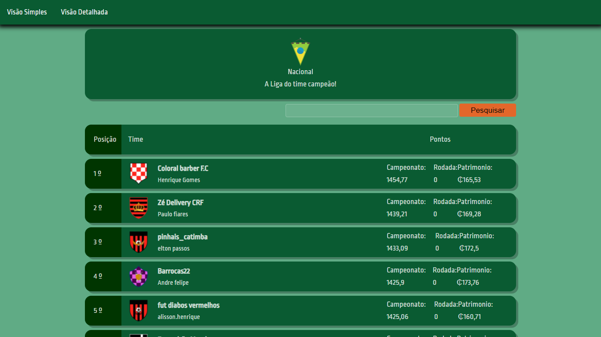
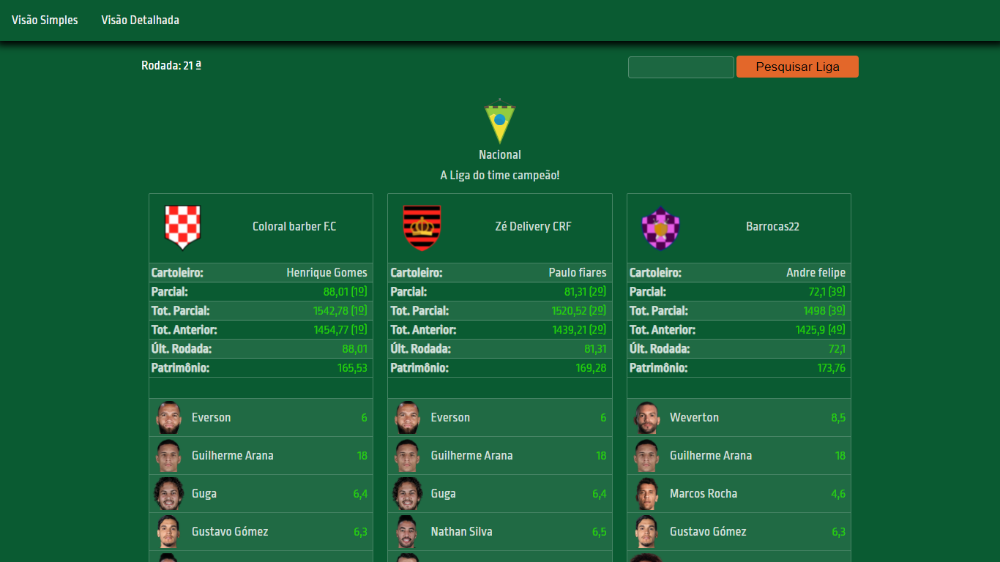
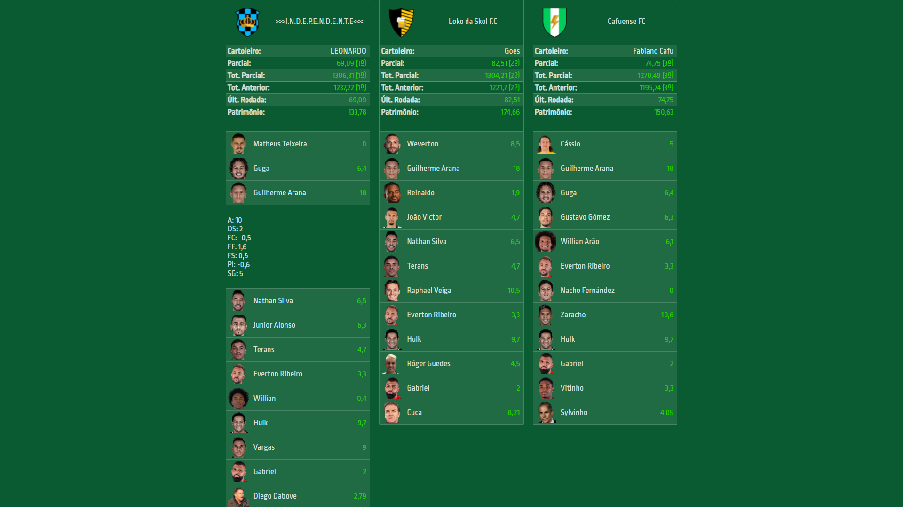

# Cartola FC - Pesquisa
> Pesquisa de ligas do _Cartola FC_ e com fácil visualização das pontuações. Para quem quer iniciar um projeto sobre o _Cartola FC_ acredito ser um bom guia.

### Pré-requisitos

Você vai precisar do [Docker](https://hub.docker.com) para rodar o Redis:
```bash
# Configurar na porta port:6379 é a porta de conexão que está configurada no appsettings.json
$ docker pull redis
```

### Visão Simples
<h1 align="center">
  
</h1>

<h1 align="center">
  
</h1>

### Visão Detalhada
<h1 align="center">
  
</h1>

<h1 align="center">
  
</h1>

### Autor
:bust_in_silhouette: __Julio C Silva__:
* [Github](https://github.com/JULIOCSILVA)
* [Linkedin](https://www.linkedin.com/in/julio-cesar-da-silva-a097b16a/)
